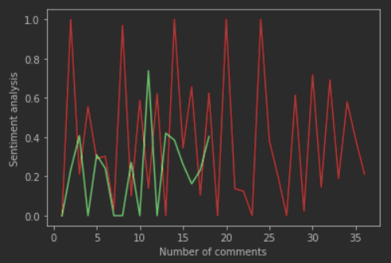
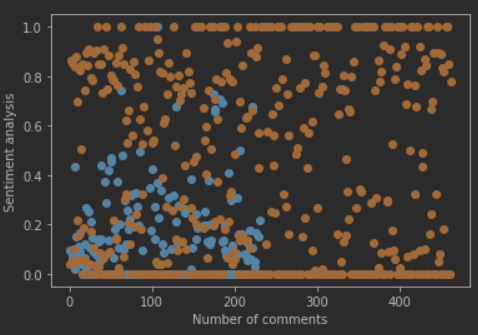
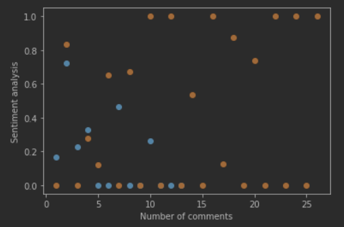

# Analyse du sentiment des Africains sur la thématique du don de sang 


Sentiment Analysis of Africans on the Subject of "Blood Donation"

<a href="https://github.com/KamgangAnthony/NLP-Analysis-Social-Media-Comments/blob/master/MainNotebook_NotebookPrincipal.ipynb"> Notebook principal | Main Notebook
</a>

```sh
* I scraped 1500+ comments from Facebook, performed sentiment analysis on them, and plotted the results 
* The goal is to know how Africans perceive blood donation and if they are in favor of it
* This is because the blood donation rate in Africa has been decreasing (only 50% of the needed blood is donated)
* At the end, I received 33% positive | 67% negative/neutral reactions
* As model, I used VADER sentiment analysis.
* The next step is to improve the model and results. Some steps could be: 
  - Adapting VADER's base lexicon to African languages
  - Seperating negative from neutral reactions
  - Manually classifying the data, then developing a supervised learning model (a completely new model).
* I'm still working on improving the model and will keep you updated.
```

-------------

```sh
* J'ai extrait 1500+ commentaires de Facebook sur la réaction des africains à la thématique dons de sang
* Effectué une analyse de sentiment et tracé les résultats 
* Le but est de comprendre la perception des Africains sur le don de sang
* Plusieurs pays africains ne reçoivent en dons que 50% de leurs besoins réels en sang.
* Les résultats : 33% de réactions positives | 67% de réactions négatives/neutres
* Utilisé VADER sentiment analysis comme modèle
* La prochaine étape est d'améliorer le modèle et ses résultats. Des moyens d'améliorations:
  - Adapter le lexique interne du modèle VADER au langage courant africain
  - Séparer les réactions négatives des réactions neutres
  - Classifier les données manuellement, puis utiliser un modèle supervisé créé soi-même
* J'améliore le modèle progressivement et ferai des mises à jour à l'avenir 
```

## Graphes d'évolution de quelques commentaires

Some curves from the Main Notebook

<p align="center" >
<em>Red : Negative/neutral comments
&nbsp
Green : Positive comments</em>
</p>
<p align="center">
    
  &nbsp
  &nbsp
    
  &nbsp
  &nbsp
    
</p>
<p align="center">
<em>
Rouge : Commentaires négatifs/neutres
&nbsp
Vert : Commentaires positifs</em>
</p>